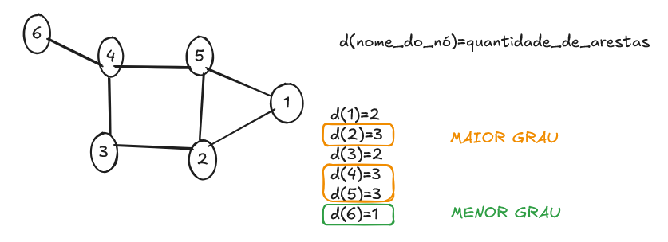

# Grafos

https://www.geeksforgeeks.org/dsa/dijkstras-shortest-path-algorithm-greedy-algo-7/

## Dígrafos

<aside>

Grau de entrada = d-(v)

Grau de saída = d+(v)

</aside>

# Representando gráficos em código

## Matriz de adjacência

## Lista de adjacência

<aside>

v0 = {v1}

v1 = {v0, v2, v3}

v2 = {v1, v3}

v3 = {v1, v2, v4}

v4 = {v3}

</aside>

Exercício

João = v0

Paulo = v1

Maria = v2

Joana = v3

Antonia = v4

Lili = v5

Raimundo = v6

v0 = {v1}

v1 = {v0, v2, v3, v4, v5}

v2 = {v1, v3}

v3 = {v1, v2, v4}

v4 = {v1, v3, v5}

v5 = {v1, v4}

v6 = {0}

|  | v0 | v1 | v2 | v3 | v4 | v5 | v6 |
| --- | --- | --- | --- | --- | --- | --- | --- |
| v0 | 0 | 1 | 0 | 0 | 0 | 0 | 0 |
| v1 | 1 |  | 1 | 1 | 1 | 1 | 0 |
| v2 | 0 | 1 | 0 | 1 | 0 | 0 | 0 |
| v3 | 0 | 1 | 1 | 0 | 1 | 0 | 0 |
| v4 | 0 | 1 | 0 | 1 | 0 | 1 | 0 |
| v5 | 0 | 1 | 0 | 0 | 1 | 0 | 0 |
| v6 | 0 | 0 | 0 | 0 | 0 | 0 | 0 |

Elvis = v0

fã1 = v1

fã2 = v2

fã3 = v3

não-fã = v4

0 = {-v1, -v2, -v3}

1 = {+v0}

2 = {+v0}

3 = {+v0}

4 = {0}

|  | v0 | v1 | v2 | v3 | v4 |
| --- | --- | --- | --- | --- | --- |
| v0 | 0 | 0 | 0 | 0 | 0 |
| v1 | 1 | 0 | 0 | 0 | 0 |
| v2 | 1 | 0 | 0 | 0 | 0 |
| v3 | 1 | 0 | 0 | 0 | 0 |
| v4 | 0 | 0 | 0 | 0 | 0 |